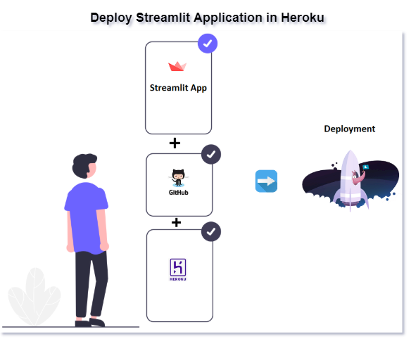

# 
** Concepts **

---

#### <u> ** 1. Import ** </u>
	import streamlit as st

#### <u> ** 2. Display ** </u>

=== "Text/Title"

	<figure>
    
    <!-- <figcaption>Text/Title</figcaption> -->
    </figure>

	- [x] **Text/Title**

			import streamlit as st

			st.title("Welcome to streamlit")
			
			st.text('Happy Learning!')

=== "Header/Subheader"
	
	<figure>
    
    <!-- <figcaption>Text/Title</figcaption> -->
    </figure>

	- [x] **Header/Subheader**

			import streamlit as st

			st.header('Header')

			st.subheader('Subheader')

=== "Markdown"

	<figure>
    
    <!-- <figcaption>Text/Title</figcaption> -->
    </figure>

	- [x] **Markdown**

			import streamlit as st

			# Basic markdown
			st.markdown('Header')

			# Advanced
			html_temp = """
			

			<h2 style="color:white;text-align:center;">Markdown html Example </h2>
			

			"""
			st.markdown(html_temp,unsafe_allow_html=True)
			st.markdown('<i class="material-icons">{}</i>'.format("people"), unsafe_allow_html=True)

			# Load stylesheet
			with open(style.css) as f:
				st.markdown(''.format(f.read()), unsafe_allow_html=True)

=== "Latex"

	<figure>
    
    <!-- <figcaption>Text/Title</figcaption> -->
    </figure>	

	- [x] **Latex**

			import streamlit as st

			st.latex(r''' e^{i\pi} + 1 = 0 ''')

			st.latex(r'''
					... a + ar + a r^2 + a r^3 + \cdots + a r^{n-1} =
					... \sum_{k=0}^{n-1} ar^k =
					... a \left(\frac{1-r^{n}}{1-r}\right)
					... ''')

=== "Write"

	<figure>
    
    <!-- <figcaption>Text/Title</figcaption> -->
    </figure>

	- [x] **Write**

			import streamlit as st

			st.write('Example text')

			st.write(['st', 'is <', 3])

			st.write("✔️ Time up!")

=== "Code"

	<figure>
    
    <!-- <figcaption>Text/Title</figcaption> -->
    </figure>

	- [x] **Code**

			import streamlit as st

			st.code('s="Happy Learning!" for i in range(0,10): print(s)')

			st.echo()

			with st.echo():
				text = 's="Happy Learning!" for i in range(0,10): print(s)'
				st.write(text)

=== "Help"

	<figure>
    
    <!-- <figcaption>Text/Title</figcaption> -->
    </figure>

	- [x] **Help**

			import streamlit as st
			
			st.help(range)
---
#### <u> ** 3. Data ** </u>

<figure>
    
    <!-- <figcaption>Text/Title</figcaption> -->
</figure>

		import streamlit as st
		import pandas as pd
		import numpy as np

		df1 = pd.DataFrame(
        np.random.randn(50, 5),
        columns=('col %d' % i for i in range(5)))
		my_table = st.table(df1)

		st.write('Dataframe example')
    	st.dataframe(df1)

		data = {'1':"True",'2':"True",'3':"False"}
    	st.json(data)

---
#### <u> ** 4. Media ** </u>

		import streamlit as st
		from PIL import Image
		import urllib.request

		# Basic image
		st.image('./image.png')

		img = Image.open("download.jfif") #open the image stored in specified location

		#Opens the image from the url
    	img = Image.open(urllib.request.urlopen("https://mms.businesswire.com/media/20200616005364/en/798639/22/Streamlit_Logo_%281%29.jpg")) 

		st.image(img, width=300, caption="Simple Image")

		# Video playing
    	vid_file = open("videofile.mp4","rb").read() #play the video stored in specified location
    	st.video(vid_file)

		#Audio
		audio_file = open('myaudio.ogg', 'rb')
		audio_bytes = audio_file.read()
		st.audio(audio_bytes, format='audio/ogg')

---
#### <u> ** 5. Charts ** </u>

		import streamlit as st
		import numpy as np
		import matplotlib.pyplot as plt

		st.line_chart({"data": [1, 5, 2, 6, 2, 1]})
		st.area_chart({"data": [1, 5, 2, 6, 2, 1]})
		st.bar_chart({"data": [1, 5, 2, 6, 2, 1]})

		arr = np.random.normal(1, 1, size=100)
		fig, ax = plt.subplots()
		ax.hist(arr, bins=20)
		st.pyplot(fig)

		st.altair_chart(data)
		st.vega_lite_chart(data)
		st.plotly_chart(data)
		st.bokeh_chart(data)
		st.pydeck_chart(data)
		st.deck_gl_chart(data)
		st.graphviz_chart(data)
		st.map(data)

---
#### <u> ** 6. Widgets ** </u>

<figure>
    
    <!-- <figcaption>Text/Title</figcaption> -->
</figure>

		import streamlit as st

		st.button('Click')
		st.checkbox('Check the checkbox')
		st.radio('Radio Button',[1,2,3])
		st.selectbox('Select', [1,2,3])
		st.multiselect('Multiselect', [1,2,3])
		st.slider('slide',min_value=0, max_value=10)
		st.text_input('Enter Username')
		st.number_input('Enter a Number')
		st.text_area('Enter Text Here!')
		st.date_input('Date Input')
		st.time_input('Time entry')
		st.file_uploader('File Uploader')
		st.beta_color_picker('Select color')

---
#### <u> ** 7. Sidebar ** </u>

		import streamlit as st
		st.sidebar.<widget>
		<widget> : button, checkbox, radio, selectbox, multiselect, slider, text_input, number_input, text_area, date_input, time_input

---
#### <u> ** 8. Control Flow ** </u>

		import streamlit as st
		st.stop()

---
#### <u> ** 9. Progress Bar ** </u>

<figure>
    
    <!-- <figcaption>Text/Title</figcaption> -->
</figure>

		import streamlit as st
		import time

		# Sample Progress bar
    	my_bar = st.progress(0)

		for percent_complete in range(100):
			time.sleep(0.1)
			my_bar.progress(percent_complete + 1)

		with st.spinner('Wait for it...'):
		    time.sleep(5)
    	st.write('Done!')

---
#### <u> ** 10. Status Messages & Others** </u>

<figure>
    
    <!-- <figcaption>Text/Title</figcaption> -->
</figure>

		import streamlit as st

		st.error('Error Message')
		st.warning('Warning Message')
		st.info('Info Message')
		st.success('Success Message')
		st.exception("IndexError('list out of index')")
		st.balloons()

		st.empty()
		place_holder = st.empty()
		place_holder.text('Replaced!')

		st.get_option(key)
		st.set_option(key)

		st.beta_set_page_config(layout='wide')

#### <u> ** 11. Cache or Optimize** </u>

		import streamlit as st

		@st.cache
		func()

#### <u> ** 12. Magic Command** </u>

		import streamlit as st
		
		'''
		# Markdown magic

		This is some _**text**_.
		'''

		df = pd.DataFrame({'col1': [40,54,67]})
		df  # <-- df values

		x = 100
		'x', x  # <-- 'x' and its value

#### <u> ** 13. Apps Deployment** </u>

=== "StreamlitShare"

	- **Using StreamlitShare**

		

		**Prerequisites**

			- Requirements.txt file
			- Github account
			- Access to share.streamlit.io
		
		??? info inline end
			- Refer the link for more details [Link](https://learnups2020.wordpress.com/2020/10/24/deployment-using-streamlit-sharing/)
	
=== "Heroku"

	- **Using Heroku**

		

	
### <u> ** 14. References ** </u>
- [docs/API](https://docs.streamlit.io/en/stable/api.html)