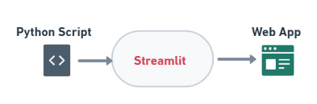

<!-- # 
 ** 🙏 Welcome to Streamlit Book ** 
 -->

<figure>
    
    <!-- <figcaption>Text/Title</figcaption> -->
</figure>

# 
 **   Streamlit Digital Book ** 

---

### <u> ** 1. Objective ** </u>

<strong>Python(🐍) script to web(🕸) Application.</strong>

### <u> ** 2. Introduction ** </u>

This book contains the details of the python package called streamlit which is used to build webapplication or dataapplications in less time and its concepts, Visit [streamlit](https://www.streamlit.io/) for more details.

??? tip inline
    <strong> :smile:  Refer the link [streamlit](https://www.streamlit.io/) </strong>

- [x] What is streamlit?
- [x] How to install?
- [x] Streamlit Concepts
- [x] Sample examples
- [x] ML Applications

### <u> ** 3. Concepts ** </u>

- [x] Title, input, text input, image, video, sidebar, markdown, latex, examples, MLapps ..etc

<!-- blockdiag {
    A -> B -> C -> D;
    A -> E -> F -> G;
} -->

<!-- ### ** References **
- [docs](https://docs.streamlit.io/en/stable/) -->