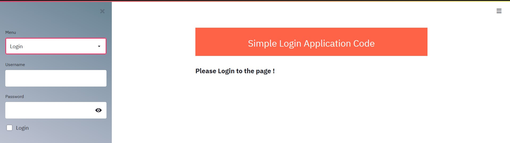
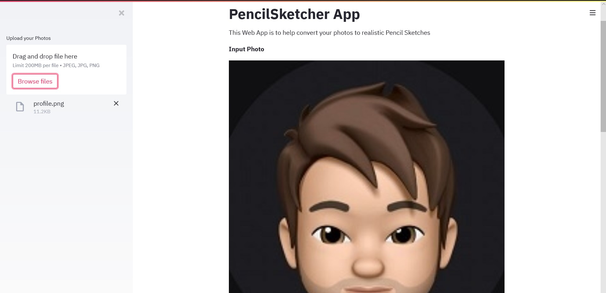
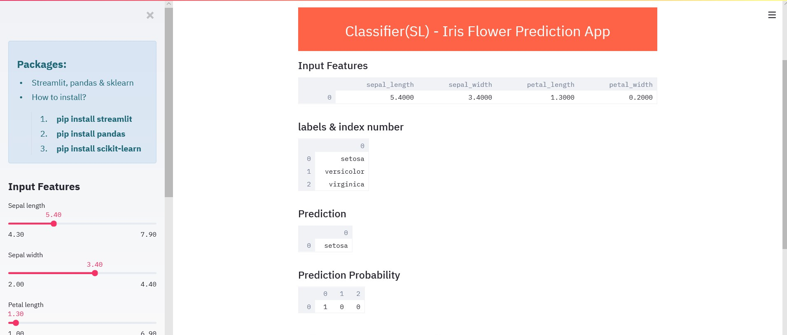

# 
** Data Applications **

---

#### ** Applications **

=== "Create/Read/Update/Delete"

    - [x] **CRUD Application**

    <figure>
    
    <figcaption>CRUD</figcaption>
    </figure>

            import streamlit as st
            import pandas as pd
            import base64
            from PIL import Image
            import json
            import urllib.request

            # Database Creation & Connection
            import sqlite3
            from sqlite3 import Connection
            import streamlit as st

            import hashlib

            URI_SQLITE_DB = "Users.db"

                html_temp = """
                    <body style="background-color:red;">
                    

                    <h2 style="color:white;text-align:center;">Simple Login Application Code</h2>
                    

                    </body>
                """
            st.set_page_config(
            page_title = 'Apps',
            page_icon = "✌",
            layout = "centered",
            initial_sidebar_state = "expanded"
            )

            def make_hashes(password):
                return hashlib.sha256(str.encode(password)).hexdigest()

            def check_hashes(password,hashed_text):
                if make_hashes(password) == hashed_text:
                    return hashed_text
                return False

            # """
            # check_same_thread = False is added to avoid same thread issue
            # """
            conn = sqlite3.connect(URI_SQLITE_DB, check_same_thread=False)
            c = conn.cursor()

            @st.cache(hash_funcs={Connection: id})
            def get_connection(path: str):
                """Put the connection in cache to reuse if path does not change between Streamlit reruns.
                NB : https://stackoverflow.com/questions/48218065/programmingerror-sqlite-objects-created-in-a-thread-can-only-be-used-in-that-sa
                """
                return sqlite3.connect(path, check_same_thread=False)

            def create_usertable(conn: Connection):
                c.execute('CREATE TABLE IF NOT EXISTS userstable(username TEXT PRIMARY KEY,password TEXT)')

            def add_userdata(conn: Connection,username,password):
                c.execute('INSERT INTO userstable(username,password) VALUES (?,?)',(username,password))
                conn.commit()

            def login_user(conn: Connection,username,password):
                c.execute('SELECT * FROM userstable WHERE username =? AND password = ?',(username,password))
                data = c.fetchall()
                return data

            def main():

                """Simple Login Application"""
                st.markdown(html_temp, unsafe_allow_html=True)
                menu = ["Home","Login","SignUp","Others","About"]
                st.markdown(
                """
                
                """,
                    unsafe_allow_html=True,
                )

                choice = st.sidebar.selectbox("Menu", menu)

                if choice == "Home":
                    st.subheader("Home Page:")

                elif choice == "Login":
                    st.subheader("**Please Login to the page !**")
                    username = st.sidebar.text_input("Username","")
                    password = st.sidebar.text_input("Password",type='password')
                
                if st.sidebar.checkbox("Login"):
                    hashed_pswd = make_hashes(password)
                    result = login_user(conn,username,check_hashes(password,hashed_pswd))
                    if result:
                    st.success("Logged In as {0!s}".format(username))
                    else:
                    st.warning("Incorrect Adhar/Passport/VoterID/Password")

                elif choice == "SignUp":
                    st.subheader("Create New Account")
                    new_user = st.text_input("Username","") 
                    new_password = st.text_input("Password",type='password')

                if st.button("Signup"):
                    create_usertable(conn)
                    add_userdata(conn,new_user,make_hashes(new_password))
                    st.success("Account created successfully. Please Login to application.")

                elif choice == "Others":
                    st.info("Please visit to nearest adhar or passport or voterid location to get any of the ID.")

                elif choice == "About":
                    st.sidebar.title("App Version details")
                    st.sidebar.info("**App version 1.0**")

            if __name__ == "__main__":
                main()

=== "PencilSketcher"

    - [x] **PencilSketcher App**

    <figure>
    
    <figcaption>PENCIL</figcaption>
    </figure>

            import streamlit as st
            import numpy as np
            from PIL import Image
            import cv2

            st.set_option('deprecation.showfileUploaderEncoding', False)

            def dodgeV2(x, y):
                return cv2.divide(x, 255 - y, scale=256)

            def pencilsketch(inp_img):
                img_gray = cv2.cvtColor(inp_img, cv2.COLOR_BGR2GRAY)
                img_invert = cv2.bitwise_not(img_gray)
                img_smoothing = cv2.GaussianBlur(img_invert, (21, 21),sigmaX=0, sigmaY=0)
                final_img = dodgeV2(img_gray, img_smoothing)
                return(final_img)

            st.title("PencilSketcher App")
            st.write("This Web App is to help convert your photos to realistic Pencil Sketches")

            file_image = st.sidebar.file_uploader("Upload your Photos", type=['jpeg','jpg','png'])

            if file_image is None:
                st.write("You haven't uploaded any image file")

            else:
                input_img = Image.open(file_image)
                final_sketch = pencilsketch(np.array(input_img))
                st.write("**Input Photo**")
                st.image(input_img, use_column_width=True)
                st.write("**Output Pencil Sketch**")
                st.image(final_sketch, use_column_width=True)

=== "IrisPrediction"

    - [x] **IrisPrediction App**

    <figure>
    
    <figcaption>IRIS</figcaption>
    </figure>

            import streamlit as st
            import pandas as pd
            from sklearn import datasets
            from sklearn.ensemble import RandomForestClassifier
            import urllib.request
            from PIL import Image

            html_temp = """
                <body style="background-color:red;">
                

                <h2 style="color:white;text-align:center;"> Classifier(SL) - Iris Flower Prediction App</h2>
                

                </body>
            """

            st.beta_set_page_config(
                    page_title = 'Iris',
                    page_icon = "🌺",
                    layout = "centered",
                    initial_sidebar_state = "expanded"
                )

            def inputFeatures():
                sepal_length = st.sidebar.slider('Sepal length', 4.3, 7.9, 5.4)
                sepal_width = st.sidebar.slider('Sepal width', 2.0, 4.4, 3.4)
                petal_length = st.sidebar.slider('Petal length', 1.0, 6.9, 1.3)
                petal_width = st.sidebar.slider('Petal width', 0.1, 2.5, 0.2)
                data = {'sepal_length': sepal_length,
                        'sepal_width': sepal_width,
                        'petal_length': petal_length,
                        'petal_width': petal_width}
                features = pd.DataFrame(data, index=[0])
                return features

            def main():
                st.markdown(html_temp, unsafe_allow_html=True)
                st.sidebar.info("""
                    ## Packages:
                    - Streamlit, pandas & sklearn
                    - How to install? 
                    > 1. **pip install streamlit**
                    > 2. **pip install pandas**
                    > 3. **pip install scikit-learn**
                    """)
                st.sidebar.header('Input Features')
                df = inputFeatures()

                st.sidebar.info("#### Iris Flower species : setosa, versicolor, virginica")
                img = Image.open(urllib.request.urlopen("https://raw.githubusercontent.com/SurendraRedd/MachineLearningCode/master/Iris_Species.png")) # Opens the image from the url
                st.sidebar.image(img, width=300, caption="")
                st.sidebar.info("#### Features : setosa, versicolor, virginica")
                img = Image.open(urllib.request.urlopen("https://raw.githubusercontent.com/SurendraRedd/MachineLearningCode/master/features.png")) # Opens the image from the url
                st.sidebar.image(img, width=400, caption="")

                st.subheader('Input Features')
                st.write(df)

                iris = datasets.load_iris()
                X = iris.data
                Y = iris.target

                clf = RandomForestClassifier()
                clf.fit(X, Y)

                prediction = clf.predict(df)
                prediction_proba = clf.predict_proba(df)

                st.subheader('labels & index number')
                st.write(iris.target_names)

                st.subheader('Prediction')
                st.write(iris.target_names[prediction])
                #st.write(prediction)

                st.subheader('Prediction Probability')
                st.write(prediction_proba)

                

            if __name__ == '__main__':
                main()